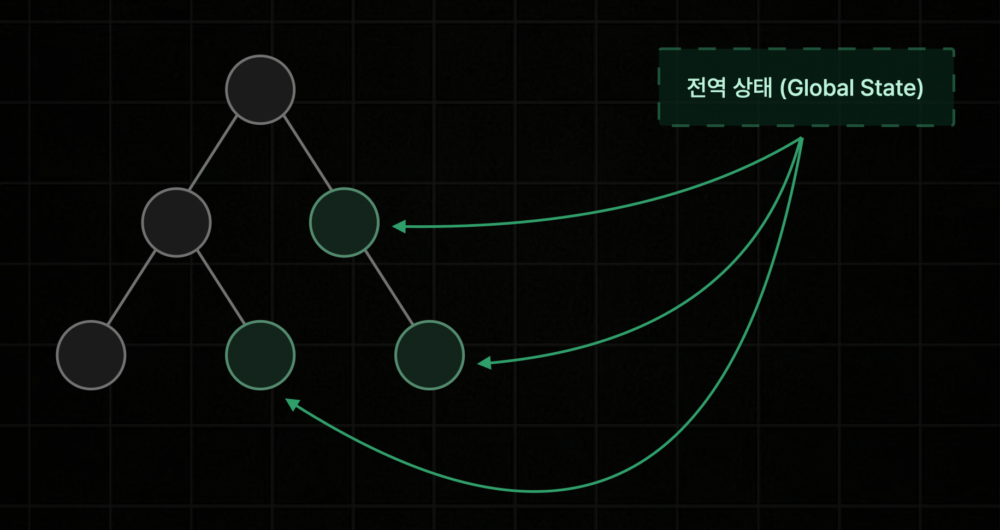
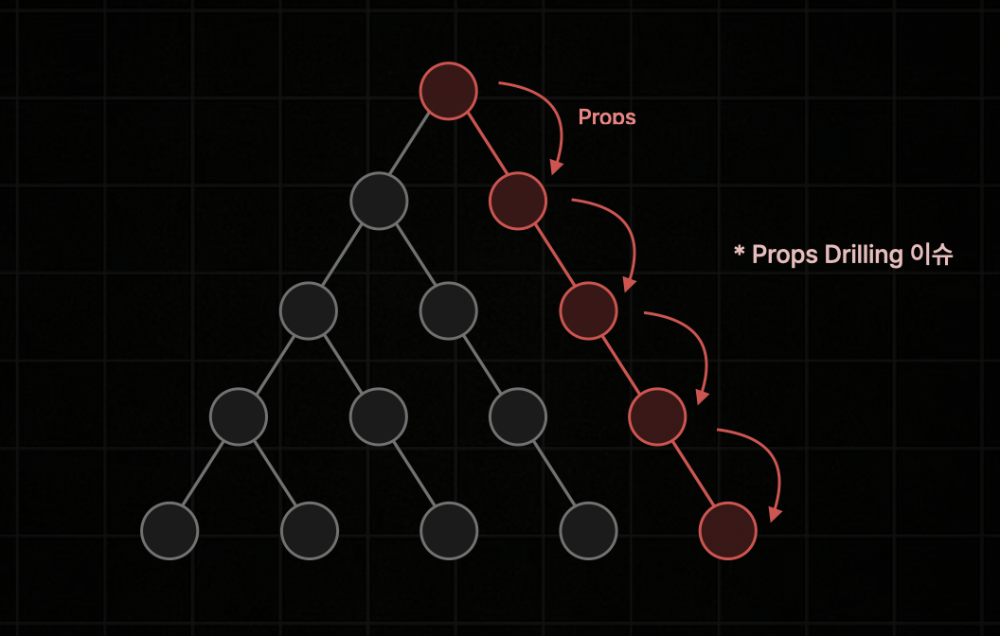

# Zustand

## 1. 전역 상태 관리와 Zustand

### 1-1. 전역 상태 관리란

- 리액트 앱의 모든 컴포넌트에서 접근 가능한 전역 State를 생성하고 수정하는 것을 의미한다
- 인증 정보, 테마 정보, 장바구니 정보 등 모든 컴포넌트에서 접근해야 하는 데이터를 관리하는 행위이다
- 어느 정도 규모 있는 서비스 개발에서는 반드시 필요한 기능이다

<div align="center">
    
</div>
<br/>

### 1-2. Props Drilling 문제

- Props만으로는 한 단계 아래의 자식 컴포넌트에게만 데이터를 전달할 수 있다
- 계층 구조가 복잡해질수록 전달되는 Props가 깊어지고 중첩되는 Props Drilling 이슈가 발생한다
- 데이터 공유가 불편해질 뿐 아니라, 하나의 데이터가 업데이트되면 해당 데이터를 Props로 전달받는 모든 컴포넌트가 리렌더링되는 성능 문제도 유발한다

<div align="center">
    
</div>
<br/>

### 1-3. Context API의 한계

- Props Drilling 이슈를 해결하기 위한 리액트 내장 기능이지만, 전역 상태 관리 전용 기능은 아니다
- Context의 상태 값이 업데이트될 때마다 하위 모든 컴포넌트가 불필요하게 리렌더링될 수 있는 치명적 한계가 있다
- **보통 특정 컴포넌트들 사이에서만 공유해야 하는 국소적 데이터 공유 용도로 사용하는 것이 일반적이다**
- 전역 상태 관리를 돕는 도구들: Redux, Zustand, MobX, Jotai, Recoil 등

<br/>

## 2. Zustand 기본 사용법

### 2-1. Zustand 설치

```bash
npm i zustand
```

### 2-2. Zustand 스토어

새로운 전역상태, 즉 state와 해당 상태를 조작하는 액션 함수들을 저장하는 객체를 말한다.

- `Zustand 스토어 생성`
  - `create` 함수를 호출하고 콜백 함수에서 객체를 반환하면 해당 객체가 스토어로 설정된다
  - 스토어 객체에는 state(예: `count: 0`)와 액션 함수(예: `increase`, `decrease`)를 함께 포함한다

```javascript
import { create } from "zustand";

create(() => {
  return {};
});
```

### 2-3. set과 get 메서드

- `get 메서드`
  - `create` 함수가 콜백 함수에 매개변수로 `set`과 `get` 메서드를 제공한다
  - `get()`은 현재 스토어 객체를 그대로 반환하여 `get().count`처럼 현재 값을 참조할 수 있다

```javascript
create((set, get) => ({
  count: 0,
  increase: () => {
    // get 메서드 사용 예시
    const count = get().count;
    set({ count: count + 1 });
  },
}));
```

- `set 메서드`
  - `set()`은 인수로 전달한 객체의 프로퍼티만 업데이트하고 나머지 프로퍼티는 유지한다
  - `set`은 함수형 업데이트도 지원하여 `set((store) => ({ count: store.count + 1 }))`처럼 작성할 수 있다

```javascript
create((set, get) => ({
  count: 0,
  increase: () => {
    // set 함수형 업데이트 예시 (get 없이 한방에 처리)
    set((store) => ({ count: store.count + 1 }));
  },
}));
```

### 2-4. 타입 정의

- 스토어의 타입을 별도로 정의하여 `create<Store>(...)`처럼 제네릭 타입 변수로 전달한다
- 타입을 지정하면 `get`이나 `set`의 매개변수 타입이 자동 추론되어 타입 오류가 해결된다
- 스토어 프로퍼티 이름이 타입과 불일치하면 경고가 발생한다

```typescript
type Store = {
  count: number;
  increase: () => void;
  decrease: () => void;
};

create<Store>((set, get) => {
	...
}));
```

### 2-5. 컴포넌트에서 스토어 사용

- `커스텀 훅 생성`
  - `create` 함수는 스토어에 접근할 수 있는 리액트 훅을 반환한다
  - 이 훅은 다른 외부 컴포넌트에서 import해 사용할 수 있다

```javascript
export const useCountStore = create<Store>((set, get) => {
	...
}));
```

- `커스텀 훅 사용`
  - 훅을 호출하면 스토어 객체가 반환되며, 구조 분해 할당으로 count, increase, decrease 등을 꺼내 사용한다

```javascript
import { useCountStore } from "@/store/count";
import { Button } from "@/components/ui/button";

export default function CounterPage() {
  const { count, increase, decrease } = useCountStore();

  return (
    <div>
      <h1 className="text-2xl font-bold">Counter</h1>
      <div>{count}</div>
      <div>
        <Button onClick={decrease}>-</Button>
        <Button onClick={increase}>+</Button>
      </div>
    </div>
  );
}
```

### 2-6. 예제 전체 코드

- `count.ts`

```ts
import { create } from "zustand";

type Store = {
  count: number;
  increase: () => void;
  decrease: () => void;
};

export const useCountStore = create<Store>((set, get) => ({
  count: 0,
  increase: () => {
    //const count = get().count;
    //set({ count: count + 1 });
    set((store) => ({ count: store.count + 1 }));
  },
  decrease: () => {
    set((store) => ({ count: store.count - 1 }));
  },
}));
```

- `counter-page.tsx`

```tsx
import { Button } from "@/components/ui/button";
import { useCountStore } from "@/store/count";

export default function CounterPage() {
  const { count, increase, decrease } = useCountStore();

  return (
    <div>
      <h1 className="text-2xl font-bold">Counter</h1>
      <div>{count}</div>
      <div>
        <Button onClick={decrease}>-</Button>
        <Button onClick={increase}>+</Button>
      </div>
    </div>
  );
}
```

## 3. Zustand 역할 분리 문제 및 해결

### 3-1. 역할 분리

- `viewer.tsx`

```javascript
import { useCountStore } from "@/store/count";

export default function Viewer() {
  const { count } = useCountStore();
  return <div>{count}</div>;
}
```

- `controller.tsx`

```javascript
import { useCountStore } from "@/store/count";
import { Button } from "../ui/button";

export default function Controller() {
  const { decrease, increase } = useCountStore();

  return (
    <div>
      <Button onClick={decrease}>-</Button>
      <Button onClick={increase}>+</Button>
    </div>
  );
}
```

- `counter-page.tsx`

```javascript
export default function CounterPage() {
  return (
    <div>
      <h1 className="text-2xl font-bold">Counter</h1>
      <Viewer />
      <Controller />
    </div>
  );
}
```

<br/>

### 3-2. 문제점 및 해결방안

버튼을 누를 때 마다 Viewer, Controller 컴포넌트가 동시에 리렌더링된다. Zustand는 컴포넌트가 불러온 저장소의 값들 중, 하나라도 업데이트가 되면 컴포넌트를 자동으로 리렌더링 시키는 문제점이 있다. Controller 컴포넌트에서 CountStore의 값을 꺼낼 때, 구조 분해 할당을 하고 있지만, 저장소 전체를 다 꺼내서 사용하고 있다.

- `셀렉터(선택자) 함수를 이용한 리렌더링 방지`
  - 저장소에서 원하는 값만 골라서 꺼내오는 콜백함수를 ‘셀렉터 함수’ 라고 부른다
  - 셀렉터 함수를 인수로 전달하면(`useCountStore((store) => store.increase)`), 선택한 값이 변경될 때만 리렌더링된다
  - Controller 컴포넌트에서 `increase`, `decrease` 함수만 불러오면 `count` 변경 시 리렌더링이 발생하지 않는다

```javascript
// ❌ 스토어 전체를 불러오면 count 변경 시에도 리렌더링 발생
const { increase, decrease } = useCountStore();

// ✅ 셀렉터 함수로 필요한 값만 불러오면 count 변경 시 리렌더링 방지
const increase = useCountStore((store) => store.increase);
const decrease = useCountStore((store) => store.decrease);
```

- `actions 객체로 함수 묶기`
  - `increase`와 `decrease` 함수를 `actions` 객체로 묶으면 셀렉터 함수 하나로 두 함수를 동시에 불러올 수 있다
  - `count` state는 불러오지 않으므로 리렌더링이 방지된다

```javascript
// count.ts
type Store = {
  count: number;
  actions: {
    increase: () => void;
    decrease: () => void;
  };
};

export const useCountStore = create<Store>((set, get) => ({
  count: 0,
  actions: {
    increase: () => {
      //const count = get().count;
      //set({ count: count + 1 });
      set((store) => ({ count: store.count + 1 }));
    },
    decrease: () => {
      set((store) => ({ count: store.count - 1 }));
    },
  },
}));

// controller.tsx
export default function Controller() {
  const { increase, decrease } = useCountStore((store) => store.actions);

  return (
    <div>
      <Button onClick={decrease}>-</Button>
      <Button onClick={increase}>+</Button>
    </div>
  );
}
```

- `방안 2. 커스텀 훅 생성`

```javascript
// count.ts
type Store = {
  count: number;
  actions: {
    increase: () => void;
    decrease: () => void;
  };
};

export const useCountStore = create<Store>((set, get) => ({
  count: 0,
  actions: {
    increase: () => {
      set((store) => ({ count: store.count + 1 }));
    },
    decrease: () => {
      set((store) => ({ count: store.count - 1 }));
    },
  },
}));

export const useCount = () => {
  const count = useCountStore((store) => store.count);
  return count;
};

export const useIncreaseCount = () => {
  const increase = useCountStore((store) => store.actions.increase);
  return increase;
};

export const useDecreaseCount = () => {
  const decrease = useCountStore((store) => store.actions.decrease);
  return decrease;
};


// viewer.tsx
export default function Viewer() {
  const count = useCount();
  return <div>{count}</div>;
}

// controller.tsx
export default function Controller() {
  const increase = useIncreaseCount();
  const decrease = useDecreaseCount();

  return (
    <div>
      <Button onClick={decrease}>-</Button>
      <Button onClick={increase}>+</Button>
    </div>
  );
}
```

<br/>

## 4. Zustand 미들웨어

미들웨어란 특정 로직의 동작 과정 중간에 끼어서 추가적인 작업을 수행하는 도구이다. Zustand는 combine, immer, subscribeWithSelector, persist, devtools 총 5가지 미들웨어를 제공한다.

- combine: Store의 타입을 자동 추론
- immer: Store 내부의 상태 업데이트를 보다 편리하게 바꿈
- subscribeWithSelector: Store 내의 특정 값 변화시, 이벤트 핸들러 호출
- persist: Store를 로컬, 세션 스토리지 등에 보관함
- devtools: Store의 값을 개발자 도구에서 확인할 수 있음

### 4-1. combine 미들웨어

- `zustand/middleware`에서 import하며, `create(combine(initialState, callbackFn))` 형태로 사용한다
- 첫 번째 인수에 state 객체를, 두 번째 인수의 콜백 함수에서 액션 함수를 포함한 객체를 반환한다
- 첫 번째 인수의 값을 기준으로 스토어의 타입이 자동 추론되므로 별도의 타입 정의가 불필요하다
- `set`과 `get`의 매개변수 타입은 액션 함수를 제외한 State만 포함하는 타입으로 추론되므로, 매개변수명을 `store` 대신 `state`로 사용하는 것이 일반적이다

```javascript
import { create } from "zustand";
import { combine } from "zustand/middleware";

// combine: 첫 번째 인수 = State, 두 번째 인수 = 액션 함수
// → State 타입이 자동 추론되어 별도 타입 정의 불필요
export const useCountStore = create(
  combine({ count: 0 }, (set, get) => ({
    actions: {
      increaseOne: () => {
        set((state) => ({ count: state.count + 1 }));
      },
      decreaseOne: () => {
        set((state) => ({ count: state.count - 1 }));
      },
    },
  })),
);
```

<br/>

### 4-2. immer 미들웨어

- `npm i immer`로 별도 패키지를 설치해야 한다
- `zustand/middleware/immer`에서 import하며, `create(immer(combine(...))) `형태로 combine을 감싸서 적용한다
- 적용 후 `set` 함수 내에서 새로운 객체를 반환하는 대신 `state.count += 1`처럼 값을 직접 변경하는 방식으로 작성할 수 있다
- `immer`가 내부적으로 불변성을 유지한 채 state를 업데이트해준다
- 복잡한 중첩 객체를 다룰 때 특히 유용하다

```javascript
import { create } from "zustand";
import { combine } from "zustand/middleware";
import { immer } from "zustand/middleware/immer";

export const useCountStore = create(
  immer(
    combine({ count: 0 }, (set, get) => ({
      actions: {
        // ✅ immer 덕분에 직접 값을 변경하는 방식으로 작성 가능
        increaseOne: () => {
          set((state) => {
            state.count += 1;
          });
        },
        decreaseOne: () => {
          set((state) => {
            state.count -= 1;
          });
        },
      },
    })),
  ),
);
```

<br/>

### 4-3. subscribeWithSelector 미들웨어

- 스토어의 특정 값만 골라서 구독하고, 해당 값이 변경될 때마다 원하는 동작을 실행할 수 있게 해준다
- subscribeWithSelector 미들웨어를 호출해서 immer 함수를 감싸도록 만들어준다
- 첫 번째 인수는 셀렉터 함수(구독 대상 선택), 두 번째 인수는 리스너 함수(변경 시 실행될 코드)이다
- 리스너 함수의 매개변수로 현재 값과 이전 값(previousSelectedState)이 제공된다
- 리스너 내부에서 `useCountStore.getState()`로 스토어를 불러오거나 `useCountStore.setState()`로 값을 업데이트할 수 있다
- 로그아웃 시 페이지 이동 등 사이드 이펙트 관리에 유용하다

```javascript
// count.ts
import { subscribeWithSelector } from "zustand/middleware";

export const useCountStore = create(
  subscribeWithSelector(
    immer(
      combine({ count: 0, doubledCount: 0 }, (set, get) => ({
        /* 액션 함수 ... */
      })),
    ),
  ),
);

// count 값이 변경될 때마다 리스너 실행
useCountStore.subscribe(
  (store) => store.count, // 셀렉터: 구독 대상
  (count, prevCount) => {
    // 리스너: 변경 시 실행
    console.log(count, prevCount);
    // setState로 다른 값도 업데이트 가능
    useCountStore.setState((store) => ({
      doubledCount: store.count * 2,
    }));
  },
);
```

<br/>

### 4-4. persist 미들웨어

- 현재 스토어의 state를 브라우저 로컬 스토리지에 자동 보관하고, 앱 새로고침 시 복원해준다.
- `persist(innerMiddleware, { name: "countStore" })` 형태로 두 번째 인수에 옵션 객체를 전달한다
- `name` 옵션으로 로컬 스토리지에 저장될 키 이름을 지정한다
- 함수는 JSON으로 파싱되지 않으므로 로컬 스토리지에 저장되지 않으며, 복원 시 액션 함수가 빈 객체로 덮어써져 기능이 동작하지 않을 수 있다
- `partialize` 옵션에 셀렉터 함수를 전달하여 State만 선택적으로 보관하면 액션 함수 유실 문제를 방지할 수 있다

```javascript
import { persist } from "zustand/middleware";

export const useCountStore = create(
  persist(
    subscribeWithSelector(
      immer(
        combine({ count: 0, doubledCount: 0 }, (set, get) => ({
          /* 액션 함수 ... */
        })),
      ),
    ),
    {
      name: "countStore", // 로컬 스토리지 키 이름
      // ⚠️ 함수는 JSON 파싱 불가 → State만 선택적으로 보관
      partialize: (store) => ({
        count: store.count,
        doubledCount: store.doubledCount,
      }),
      // Local Storage 대신 Session Storage 사용시 적용
      storage: createJSONStorage(() => sessionStorage),
    },
  ),
);
```

<br/>

### 4-5. devtools 미들웨어

- Redux DevTools 확장 프로그램과 연동하여 스토어 값의 변화를 실시간으로 디버깅할 수 있다. Redux DevTools 크롬 확장 프로그램을 별도로 설치해야 한다.
- `devtools(innerMiddleware, { name: "countStore" })` 형태로 사용하며, 가장 바깥쪽에 감싸는 것이 일반적이다.

```javascript
import { devtools } from "zustand/middleware";

// 전체 미들웨어 중첩 구조
export const useCountStore = create(
  devtools(
    persist(
      subscribeWithSelector(
        immer(
          combine({ count: 0 }, (set, get) => ({
            /* 액션 함수 ... */
          })),
        ),
      ),
      { name: "countStore", partialize: (store) => ({ count: store.count }) },
    ),
    { name: "countStore" }, // DevTools에 표시될 이름
  ),
);
```

<br/>

## 5. TODO 리스트 예시

- `types.ts`

```javascript
export interface Todo {
  id: number;
  content: string;
}
```

- `store/todos.ts`

```ts
import { create } from "zustand";
import { combine } from "zustand/middleware";
import { immer } from "zustand/middleware/immer";
import type { Todo } from "@/types";

const initialState: {
  todos: Todo[];
} = {
  todos: [],
};

const useTodosStore = create(
  immer(
    combine(initialState, (set, get) => ({
      actions: {
        createTodo: (content: string) => {
          set((state) => {
            state.todos.push({
              id: new Date().getTime(),
              content,
            });
          });
        },
        deleteTodo: (targetId: number) => {
          set((state) => {
            state.todos = state.todos.filter((todo) => todo.id !== targetId);
          });
        },
      },
    })),
  ),
);

export const useTodos = () => {
  const todos = useTodosStore((store) => store.todos);
  return todos;
};

export const useCreateTodo = () => {
  const createTodo = useTodosStore((store) => store.actions.createTodo);
  return createTodo;
};

export const useDeleteTodo = () => {
  const deleteTodo = useTodosStore((store) => store.actions.deleteTodo);
  return deleteTodo;
};
```

- `todo 화면`

```javascript
// pages/todo-list-page.tsx
import TodoEditor from "@/components/todo-list/todo-editor";
import TodoItem from "@/components/todo-list/todo-item";
import { useTodos } from "@/store/todos";

export default function TodoListPage() {
  const todos = useTodos();

  return (
    <div className="flex flex-col gap-5 p-5">
      <h1 className="text-2xl font-bold">TodoList</h1>
      <TodoEditor />
      {todos.map((todo) => (
        <TodoItem key={todo.id} {...todo} />
      ))}
    </div>
  );
}

// components/todo-list/todo-editor.tsx
import { useCreateTodo } from "@/store/todos";
import { Button } from "../ui/button";
import { Input } from "../ui/input";
import { useState } from "react";

export default function TodoEditor() {
  const createTodo = useCreateTodo();
  const [content, setContent] = useState("");

  const handleAddClick = () => {
    if (content.trim() === "") return;
    createTodo(content);
    setContent("");
  };

  return (
    <div className="flex gap-2">
      <Input
        value={content}
        onChange={(e) => setContent(e.target.value)}
        placeholder="새로운 할 일을 입력하세요..."
      />
      <Button onClick={handleAddClick}>추가</Button>
    </div>
  );
}


// components/todo-list/todo-item.tsx
import { useDeleteTodo } from "@/store/todos";
import { Button } from "../ui/button";

export default function TodoItem({
  id,
  content,
}: {
  id: number;
  content: string;
}) {
  const deleteTodo = useDeleteTodo();

  const handleDeleteClick = () => {
    deleteTodo(id);
  };

  return (
    <div className="flex items-center justify-between border p-2">
      {content}{" "}
      <Button onClick={handleDeleteClick} variant={"destructive"}>
        삭제
      </Button>
    </div>
  );
}

```
